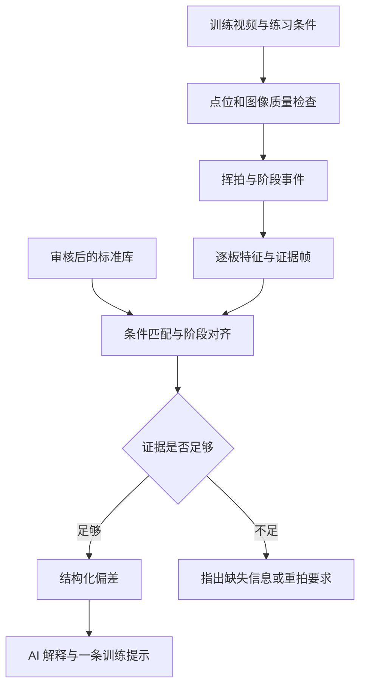

# pingpong-coach：现状审查与动作标准体系设计

审查日期：2026-09-16。仓库：<https://github.com/codertony/pingpong-coach>。

审查基线：`main`，提交 `fbfb7210ae96e776537c9e528d2c442f8fe6b69c`。

本次只读拉取、检查代码和文档、检索公开资料；未修改仓库代码，未运行摄像头或付费模型，未上传个人训练视频。下文分别标明代码事实、仓库历史记录和设计建议。没有用户本次不满意的原始视频与对应响应，因此不能断言每一项发现就是该次结果的直接原因，也不能给出现模型的实测诊断准确率。

## 1. 结论与优先决策

当前项目已经有浏览器采集、MediaPipe 骨架、挥拍状态机、特征汇总、关键帧、多模态模型和输出校验的基础链路。但距离“细节可信、关键时刻准确、能与标准对照的教练系统”，还缺三个核心能力：

1. **可靠的动作证据**：每一板的边界、阶段、有效关键帧和逐板指标需要先正确。
2. **可执行的技术标准**：有来源、有适用条件、有教练审核的动作规则及参考序列。
3. **独立的质量评估**：人工标注的真实视频、阶段真值与教练对问题的判断。

建议采用 **教学文字 + 专业示范视频 + 结构化点位时序 + 条件化规则 + 错误案例** 的混合标准库。保持现有 MediaPipe 作为第一版测量底座；先完成固定机位、定点正手攻球的小闭环，再决定是否换姿态模型、引入球拍检测或双机位。

“正确动作”应是一组适用条件下的合理动作范围与训练约束。不能把某位运动员的每个关节角度视为人人必须复制的唯一答案，也不能把“与专业选手不像”直接转成“错误”。

## 2. 仓库现状：哪些已具备，哪些未闭环

| 层 | 已有实现 | 当前实际限制 |
| --- | --- | --- |
| 采集 | 摄像头/导入视频、源时间戳、Worker、骨架叠加 | 拍摄与推理质量必须在实际设备上验收 |
| 姿态 | MediaPipe 身体 33 点，可选手部 21 点 | 产品测量契约主要是二维；手部模型加载成功不等于握拍中的手指可靠 |
| 分段 | 准备→引拍→前挥→还原状态机 | 主要依赖腕点与准备区距离，没有可靠触球事件，连续动作存在合并问题 |
| 数值特征 | 肘角范围、腕速峰值附近肘角、肘相对躯干位移、返回时间、组内一致性 | 缺少分阶段轨迹、逐板差异和与参考动作的比较；另有汇总缺陷 |
| 关键帧 | JPEG 缓存、帧 ID 对齐、图片预算 | 按时间比例选帧；实际图片候选与姿态候选不同步；阶段角色在组包时丢失 |
| 动作知识 | 两条正手攻球知识条目；一条内置本地规则 | 两条知识均为 observation_only，referenceId 均为空 |
| AI 反馈 | 一次一组、当前关注点、结构化输出、证据 ID 校验 | 合法引用不证明画面解释正确；目前没有可用的完整标准对照 |
| 评估 | 有评估脚本、人工标注 schema、验收口径 | 提交中的 evaluation/samples.json 的 samples 为空；不代表用户本地没有视频 |

范围也需要明确：代码中的 `StrokeType` 目前只有 `forehand_drive`。不能把当前能力直接理解为已经覆盖反手攻球、正手起下旋和反手起下旋。

来源：[规格](https://github.com/codertony/pingpong-coach/blob/fbfb7210ae96e776537c9e528d2c442f8fe6b69c/docs/spec.md)、[动作类型](https://github.com/codertony/pingpong-coach/blob/fbfb7210ae96e776537c9e528d2c442f8fe6b69c/packages/contracts/src/constants.ts)、[评估清单](https://github.com/codertony/pingpong-coach/blob/fbfb7210ae96e776537c9e528d2c442f8fe6b69c/evaluation/samples.json)。

## 3. 与当前体验直接相关的发现

### 3.1 优先处理的实现问题

| 编号 | 发现与证据性质 | 对结果的影响 | 后续修正方向 |
| --- | --- | --- | --- |
| R1 | **确定的单位混用**：TrainingSession.computeFeatures 中，perStroke 已是每板肘角，median(perStroke) 却传入 computeElbowAngleAtWristPeak 的 anchorTimeMs 参数 | 假设肘角中位数 100°，代码会再次查找约 100ms 附近，而不是输出 100°；通常缺失，偶尔取错区间 | 逐板先测量，再聚合角度数值；时间戳与角度分离 |
| R2 | **确定的阶段标签丢失**：selectRepresentativeFrames 返回 frameId + role；调用 buildKeyframes 时只传 frameId，未传 role，函数默认 other | 发给模型和复查界面的关键帧失去原本阶段标签 | 按帧保留 strokeId、eventId、role、时间与阶段置信度 |
| R3 | **确定的候选集合不一致**：选帧使用所有姿态帧；JPEG 实际每 3 帧采一次。所选 ID 不在图片缓存时只记录 missing | 即使附近存在可用图片，也不会自动补选；本次到底少多少帧需真实包统计 | 从“有像素且有姿态”的交集挑选，并检查编码完成状态 |
| R4 | **选帧没有事件语义**：引拍取 start→anchor 的中点，还原取 anchor→end 的中点，anchor 是腕速峰值 | 名为引拍的图不一定是引拍末端；名为还原的图也未必对应目标阶段 | 保存真实阶段事件，阶段内按质量择帧 |
| R5 | **组统计替代逐板过程**：角度范围等在整组区间求值，模型主要收到少量汇总标量 | 无法回答“哪一板、哪个阶段、小臂变化从何时开始”；一帧异常可放大全组范围 | 逐板、逐阶段计算，保留短轨迹，再汇总中位数及离散程度 |
| R6 | **分段与动作是否还原绑在一起**：需要在准备区稳定驻留才能闭合一板 | 恰好没还原好的动作可能不被识别为有效板；影响计数，也使需要纠正的动作被过滤 | 将“发生了一次挥拍”与“该次是否完成目标还原”分开 |
| R7 | **标准尚未建立**：知识条目均未审核，客户端 referenceId 固定为 null | 系统只能描述，不能有依据地判断哪些细节应调整 | 建立可溯源参考注册表和适用条件匹配，不能只改 reviewed 开关 |

R1–R3 的主要来源：[TrainingSession](https://github.com/codertony/pingpong-coach/blob/fbfb7210ae96e776537c9e528d2c442f8fe6b69c/apps/web/src/training/training-session.ts)、[特征计算](https://github.com/codertony/pingpong-coach/blob/fbfb7210ae96e776537c9e528d2c442f8fe6b69c/packages/motion-core/src/features.ts)、[选帧与组图](https://github.com/codertony/pingpong-coach/blob/fbfb7210ae96e776537c9e528d2c442f8fe6b69c/apps/web/src/evidence/evidence-builder.ts)、[图片采集](https://github.com/codertony/pingpong-coach/blob/fbfb7210ae96e776537c9e528d2c442f8fe6b69c/apps/web/src/evidence/keyframe-capture.ts)。

这些是只读代码审查结论，本次未执行运行时复现。R1、R2 可从参数与数据流直接确认；缺帧比例、具体诊断退化程度则需要实际素材量化。

### 3.2 分段问题比“挑一张更好看的图”更基础

仓库 `F-022` 仍记为 OPEN：连续对拉存在多板合并。历史记录在一支约 8.15 秒素材上只闭合 2 次，并记录回位距离靠近 0.30 体尺度阈值边界、区内停留短于闭合要求。此处是**仓库历史实测记录**，不是本次新测，也不是有人工真值支持的准确率。

进一步看代码，前挥的触发主要是腕点到准备区的距离缩短，返回阶段主要是进入准备区。该径向信号不能充分区分空间轨迹、随挥和真正回位。`cameraView`、`handedness` 虽存在配置里，并没有在分段器中形成实际方向约束；`wristRelReadyZonePx` 也没有被状态转移使用。

设计建议：把腕点在身体坐标中的轨迹、转向、速度、肘部变化作为多信号证据；输出“挥拍候选”后单独评价还原，不以还原达标作为所有动作被看见的前提。

来源：[状态机](https://github.com/codertony/pingpong-coach/blob/fbfb7210ae96e776537c9e528d2c442f8fe6b69c/packages/motion-core/src/segmentation.ts)、[已知失败 F-022](https://github.com/codertony/pingpong-coach/blob/fbfb7210ae96e776537c9e528d2c442f8fe6b69c/docs/known-failures.md)、[历史实测记录](https://github.com/codertony/pingpong-coach/blob/fbfb7210ae96e776537c9e528d2c442f8fe6b69c/docs/evaluation-log.md)。

### 3.3 两个容易高估的能力

**手部 21 点。** 代码有手部几何函数，但生产路径中未发现 extractHandGeometry 被用于训练证据计算。历史记录还报告同一素材抽查 31 帧只检出 2 帧，其中一帧疑似落在人脸。不能据此报告普遍检出率，更不能宣称已经能稳定诊断手腕与握拍细节。后续应增加手部 ROI、身体腕点关联、尺度和运动连续性检查；没有逐点置信度，并不意味着工程上完全无法做误检筛查。

**大模型守约。** 现有校验器能查结构、证据 ID、训练项和部分越界措辞；它不能证明模型真的从图片看到了所声称的变化。引用了 kf-2，也可能误读 kf-2。必须把“格式合规率”“事实正确率”“教练建议适用率”分开。

此外，准备区由用户自己的腕点分布自动标定，它可以服务于跟踪，却不能自然成为“正确准备姿势”。用户稳定地做错，也会产生稳定的个人基线。

## 4. 研究与资源：可以借鉴什么

| 资料 | 已核实内容 | 对项目的用法 | 不应推出的结论 |
| --- | --- | --- | --- |
| [ITTF 正手攻球教学](https://www.ittfeducation.com/how-to-play-table-tennis-forehand-drive/)与[反手攻球教学](https://www.ittfeducation.com/how-to-play-table-tennis-backhand-drive/) | 官方有分技术类型的教学示范 | 建立术语、阶段、教学要点与参考视频目录 | 页面不是可直接执行的全套角度阈值；本次未逐帧审核视频 |
| [Bańkosz 与 Winiarski，2020](https://www.jssm.org/volume19/iss1/cap/jssm-19-138.pdf) | 研究正手上旋对上旋/下旋来球，使用运动学采集与压电触球识别，报告较大角度差异及功能性变异 | 标准需按来球条件划分，并允许不同协调方式 | 上旋拉球的数值不能直接当作定点正手攻球的合格线 |
| [Kulkarni 与 Shenoy，CVPR Workshop 2021](https://arxiv.org/abs/2104.09907) | 14 名专业球员、11 类动作、22,111 个视频；二维姿态 + TCN 做动作分类 | 将来动作分类与时序编码的参考 | 论文中的 99.37% 验证分类准确率不等于错误诊断准确率 |
| [Martin 等，2021，三路融合与 TTStroke-21](https://arxiv.org/abs/2109.14306) | 融合 RGB、光流和姿态，做细粒度动作分类与分段 | 借鉴多信号阶段识别；了解动作分类数据集 | 没有因此得到每个关节“对/错”的教练标签 |
| [TTNet，CVPR Workshop 2020](https://arxiv.org/html/2004.09927v1) | 120fps 数据；球检测、分割及球台反弹/触网事件 | 后续球轨迹和快速事件研究底座 | 现成事件头并非人体动作评分器，也不是已训练好的球拍触球检测器 |
| [Tumpach 与 Kán，2023](https://arxiv.org/abs/2303.15259) | 研究人体动作时间对齐，采用关键帧对应约束动态规划，并提醒保留有意义的竖直方向信息 | 阶段锚定的时序比较 | 不受限的时间变形可能掩盖用户真实节奏错误 |
| [MediaPipe Pose](https://developers.google.com/edge/mediapipe/solutions/vision/pose_landmarker) / [Hand](https://developers.google.com/edge/mediapipe/solutions/vision/hand_landmarker) | 分别提供 33 个身体点、21 个手部点；可输出估计的世界坐标 | 保留现有实时底座，明确观察范围 | 模型估计 3D 不等于经过标定的真实三维测量 |
| [Sports2D](https://github.com/davidpagnon/Sports2D) | 提供二维姿态/角度，明确强调运动平面和拍摄方向限制 | 作为离线算法比较及导出工具 | 相机角度不同的数据不能直接按二维角度严格比较 |
| [Pose2Sim](https://github.com/perfanalytics/pose2sim) | 多机位标定、同步、三角化与运动学流程 | 中后期制作更可靠的三维参考序列 | 多加一台相机但不标定、不同步，不会自动获得可靠 3D |

检索中还发现 2026 年 OpenPose + YOLO 多维乒乓球评价论文，但全文访问失败，因此本方案不采用其具体阈值或准确率作为依据。现有公开资料中，本次没有核实到一个能直接导入、覆盖个人纠错需求的完整“通用标准动作库”。

## 5. 标准应该做成什么

### 5.1 三种方案比较

| 路线 | 优点 | 缺点 | 建议 |
| --- | --- | --- | --- |
| 只有文字知识 | 快、成本低，适合解释和训练提示 | 无法精确定位哪一帧、哪个点偏离；含糊词难执行 | 作为知识层 |
| 单个专业视频/骨架模板 | 可对照、有视觉依据 | 对机位、来球、体型、个人风格敏感；相似度不能等同正确度 | 作为有条件的示例 |
| 多参考序列 + 可计算规则 + 审核错误案例 | 能定位、能解释、可验证，支持个人化 | 需要采集、标注和教练审核 | 推荐主方案 |

### 5.2 一个标准包的组成

| 层 | 保存内容 | 作用 |
| --- | --- | --- |
| 适用条件 | 技术类型、练习目标、持拍手、握法、来球旋转/高度/速度等级、站位、机位、示范速度 | 先决定是否可比 |
| 来源 | 文献/教学 URL、原文位置或视频时间段、作者、审核人、日期、版本、使用许可 | 知道标准从哪里来 |
| 教学描述 | 要点、原因、常见误解、适用水平、允许个体差异 | 给人和 AI 理解 |
| 专业示范 | 原始视频、帧时间戳、拍摄元数据、多个合格重复 | 保留视觉事实 |
| 结构化运动 | 点位轨迹、可见性、质量、阶段事件、角度与相对位置曲线 | 支持机器比较 |
| 判断规则 | 特征定义、可观察条件、参考范围、阈值来源、不可判条件 | 决定哪里需要关注 |
| 错误与训练 | 已审核问题片段、正常变体、对应纠正提示与训练动作 | 将偏差转为行动 |

**文字与骨架是同一条标准的两种表达。** 自然语言解释目标，轨迹描述实际动作，规则连接二者。AI 可以提取候选标准、标注候选帧；专业审核决定其适用性。模型自身的判断不充当最终真值。

### 5.3 标准的层次

区分四种来源，不能混成一个“标准分”：

1. 跨个体的技术原则：如该动作任务的阶段与空间目标。
2. 条件化参考范围：来自相同技术与来球条件的多个合格示范。
3. 个人可行目标：教练确认用户可以执行、当前值得练的约束。
4. 当前个人基线：用于描述进步，但不自行证明动作正确。

统计上“超出参考范围”是复核信号，只有在适用条件、观察质量和教练规则满足时，才升级为“建议调整”。少量示范的分位数是探索性范围，不能宣称普遍的正常区间。

### 5.4 第一批标准如何取得

建议从一个任务做起：右手横板、定点正手攻球、固定机位、可控来球节奏。

- 从 ITTF 等官方教学整理候选要点，记录原始来源；不要先编一组看似精确的角度。
- 请熟悉基础动作教学的教练按同一拍摄协议示范。初期建议 2–3 人、每人每种条件 10–15 板；这些是项目采样建议，不是已验证的充分样本量。
- 包含自然速度与慢速说明；两者分别标注，不能把慢动作的时间参数与正常速度比较。
- 标引拍开始、引拍末端、前挥、触球可见区间、随挥结束、回位/下一板启动；不可见的事件明确缺失。
- 标注少量关键关节，修正示范中的错误骨架；专业运动员视频经姿态模型提取后，仍可能出现错误点位。
- 请另一位教练复核部分样本；分歧保留为分歧或不可判，不强行“投票制造真值”。
- 加入用户自然发生的错误和已改善片段。参考示范、校准集、测试集独立，禁止用同一段视频的相邻帧分到不同集合。

如果暂时找不到教练，仍可完成采集、事件标注和描述性对照，但这些规则保持“待审核”。不应为方便上线直接将 status 改为 reviewed。

## 6. 关键帧：先识别事件，再选择图像

### 6.1 需要的事件结构

| 事件 | 候选证据 | 可输出的名称 |
| --- | --- | --- |
| 准备参考 | 准备区域、腕部低速区段，结合动作上下文 | 准备参考帧 |
| 引拍末端 | 身体相对腕/拍轨迹转向、阶段模型、肘肩信息 | 引拍末端候选/已复核事件 |
| 前挥 | 朝目标方向的运动及速度变化 | 前挥帧；腕峰另行命名 |
| 触球 | 球拍接近、球轨迹变化、同步音频或人工标注 | 触球时间区间；证据不足则未知 |
| 随挥末端 | 前挥后的轨迹终点与转向 | 随挥末端候选 |
| 还原/下一板开始 | 返回功能性准备区或新一轮引拍启动 | 还原事件，允许缺失 |

不是每一板都必须找到全部事件。首版可完全不判触球时刻，仍然提供可靠的引拍、肘部与还原对比。没有球拍和球的证据时，不把腕速峰值改名为击球。

事件对象建议包含：`eventType、strokeId、timeMs、timeIntervalMs、confidence、method、supportFrameIds、reasonIfMissing`。源帧时间和实际反馈到达时间分别保存。

### 6.2 图像清晰与事件准确要分别验收

一次事件附近可能“最准确的一帧最模糊”。因此保存两种结果：

- **事件定位**：事件可能在哪个时间区间，误差多大。
- **展示关键帧**：区间内或有明确偏移说明的邻近清晰帧，用于看动作细节。

不能为了选清晰图而悄悄改变触球时刻。触球附近可显示前/中/后三帧的小序列，并标明哪些帧未实际拍到接触。

推荐选帧过程：

1. 从有原始像素、有对应姿态、有时间戳的候选交集中选择。
2. 先限制同一板、同一事件窗口；跨出窗口即报告缺失，不借用另一板。
3. 在窗口中比较关注区域清晰度、相关关节可见性、人体/手部像素尺度和遮挡。
4. 按阶段覆盖和问题证据排序；组级预算优先保留一板典型动作和一板代表性偏差，不盲目每板发 6 张。
5. 保存全身上下文 + 手臂局部裁剪。裁剪必须有原图坐标映射，角度测量仍在一致坐标空间完成。
6. 每张图标动作编号、阶段、源时间、事件距离、质量状态；提供逐帧前后切换与短片回放。

不要用生成式补帧或修复图像作为测量依据：它们可能生成实际上不存在的球、手指或球拍位置。

### 6.3 拍摄和处理建议

首版建议固定机位、充足光照、1080p/60fps；关心快速触球时尝试 120fps，同时保证曝光足够短。60fps 约每 16.7ms 一帧，120fps 约 8.3ms；这只是采样间隔，不是完整系统误差。高帧率不自动消除运动模糊。

源视频、实际解码、姿态推理、JPEG 候选分别报告帧率。目前每 3 帧存一张图，在约 30fps 条件下只有约 10 张/秒候选，即约 100ms 间隔；实际值还受丢帧影响。

实时预览继续允许丢旧帧，避免延迟累积；组后复查从有界压缩视频片段/环形缓存按源帧时间重新读取事件附近帧。导入视频的精细分析应按可控解码步长处理，不能依赖实时播放时恰好处理了哪些帧。

新增片段回放/压缩缓存是建议扩展，超出现有首版“不做完整视频录制”的范围；无需长期保存全分辨率原始帧。所有在线滤波继续使用因果方法；若将来使用有界延迟确认，应明确 eventTime 与 availableAt，不能把组后回看误称零延迟实时。

## 7. 点位、特征与可观察边界

| 要回答的问题 | 需要的点/信息 | 首版能做的观测 | 何时不能判断 |
| --- | --- | --- | --- |
| 小臂有没有明显屈伸 | 持拍侧肩、肘、腕的连续点位 | 二维肘角曲线、阶段内变化幅度和时间 | 遮挡、运动出平面；不能推断小臂发力大小 |
| 大臂是否抬起较多 | 肩、肘、躯干轴 | 肘相对肩/躯干的位置变化，上臂投影角 | 不能据此断言肌肉僵硬或代偿原因 |
| 是否前倾/起伏明显 | 肩中点、髋中点、膝、踝，合适侧面 | 躯干投影倾角与髋高度变化 | 正面看不清前倾；髋位置不等于重心/足底承重 |
| 还原是否跟上下一板 | 腕/拍轨迹、阶段事件、来球/下一板信息 | 随挥到准备区/下一板的时间关系 | 分段失败；原地停留不代表功能上准备好了 |
| 手腕是否相对前臂改变 | 肘、腕、掌轴、清晰手部 ROI | 合适视角下的投影夹角变化 | 握拍遮挡、轴向旋转、手点误检；不把小臂旋转误判为手腕屈伸 |
| 拍面朝向是否合适 | 球拍可见轮廓/关键点、相机信息、来球条件 | 后期做投影姿态或经过验证的 3D 估计 | 仅手部骨架不足；背面/侧缘、运动模糊可能不可判 |
| 击球是否偏早/偏晚 | 来球轨迹、弹跳/接触区间、球拍、身体位置 | 后期研究接触相对来球阶段及身体的关系 | 腕峰不能替代接触；单张姿势照不能决定时机 |
| 腿髋躯干小臂是否协调 | 多段运动时序；必要时同步多机位或传感器 | 当前仅做可见的粗粒度时序比较 | 不输出精确传力效率、肌肉激活或地面反作用力 |

二维点位只要机位改变就可能改变投影。Sports2D 的官方说明也明确要求运动平面与拍摄方向匹配。因此应为每个指标定义允许机位和质量要求，不能用一个全局“骨架可见”状态许可所有精细结论。[Sports2D 限制说明](https://github.com/davidpagnon/Sports2D)

## 8. 具体如何和标准对照

### 8.1 对照顺序

1. **条件匹配**：先选同技术、同来球条件、相容机位的参考；没有合适参考就不评分。来球旋转首版由发球机设置/用户配置提供，不让普通视频自动猜。
2. **坐标归一化**：用身体中心消除平移，用稳定体尺度减少拍摄距离影响；左右手使用解剖语义转换。保存原坐标和转换结果。
3. **保护有意义的方向**：肘部局部指标可用身体相对坐标；前倾、站位等指标保留重力方向或球台方向。不能把每帧躯干都旋直后再声称用户没侧倾。
4. **阶段对齐**：先对齐引拍末端、前挥、随挥等事件；阶段内做重采样或受限 DTW。
5. **双通道比较**：归一化时间比较动作形态；原始毫秒与阶段占比比较节奏。不能让 DTW 把“启动迟了”拉伸成没有问题。
6. **逐项出偏差**：每一板、每个目标输出观测值、参考范围、置信/误差、出现次数、支持帧和不适用原因。
7. **跨板复核**：优先反馈重复出现且证据清楚的问题，单帧孤立异常先排查识别跳点。

时间对齐可借鉴关键帧约束动态规划研究，但这里的具体权重、阶段规则和门槛都需要项目自身数据验证。[时间对齐研究](https://arxiv.org/abs/2303.15259)

### 8.2 不能只给“相似度 78 分”

更有用的输出单元是：

> 第几板、哪个阶段、哪些点位发生了什么；与哪一条审核标准不同；证据是否清楚；下一组只改什么；改完看什么指标。

例如“前挥阶段，二维肘角变化较参考序列小”是一个可测的候选偏差，但不能直接翻译成“小臂没有发力”。模型应同时考虑是否存在视角、来球条件、主动挡球等替代解释。

也不建议把“每次动作一致”当作正确。稳定性是一个维度，适当性是另一个维度。

### 8.3 建议的契约扩展

以下是结构设计，不是本次代码修改：

| 对象 | 主要字段 |
| --- | --- |
| ReferenceTemplate | id/version、适用条件、sourceRefs、mediaHash、许可、示范者元数据、教练审核、阶段与点位 |
| TechniqueRule | id/version、目标描述、requiredSignals、适用条件、特征定义、referenceTemplateIds、阈值来源、不可判条件、提示/训练项 |
| PhaseEvent | eventType、strokeId、源时间或区间、置信度、估计方法、证据帧 |
| MetricTrace | metricId、单位、坐标空间、逐帧值、缺失掩码、质量、模型和滤波版本 |
| ComparisonFinding | issueId、ruleId、referenceId、strokeIds、phase、差异、证据、状态、替代解释 |
| EvidenceKeyframe | frameId、strokeId、eventId、role、源时间、ROI 映射、清晰度、质量、距事件的时间偏移 |

示例规则的阈值应先为空，而不是预填一个未经验证的数字：

```json
{
  "id": "forehand_drive_elbow_flexion_forward_v1",
  "status": "draft",
  "strokeType": "forehand_drive",
  "phase": "forward",
  "requiredSignals": ["racket_shoulder", "racket_elbow", "racket_wrist"],
  "metric": "elbow_flexion_delta_2d_deg",
  "coordinateSpace": "image_2d",
  "referenceTemplateIds": [],
  "acceptableRange": null,
  "thresholdBasis": "pending_coach_review_and_calibration",
  "notInferable": ["muscle_force", "muscle_tension"]
}
```

审核时不仅检查一个非空 referenceId，还要确认参考实际存在、媒体与版本可取、适用条件匹配。代码计算阈值、教学原则和个人训练目标分开管理。

## 9. AI 的位置与反馈界面

推荐结构：



视觉模型负责提点，时序模块负责找阶段，比较模块负责算差异；大模型组织解释、检查上下文和推荐已审核训练项。多模态模型可发现候选问题，但不能凭空生成测量值或把未审核猜测升格为确定纠错。

产品上分两层：

- **练习中**：每组最多一条优先提示。可以保留你“一次只注意一个点”的习惯。
- **练习后**：查看多个维度的详细对照，包含不可判项。分析全面不意味着同时播报多个纠正动作。

复查页建议提供同阶段的用户/参考并排图、对应关键点、短片回放、肘角等曲线和问题证据。二维叠加只对相容视角展示；不能强行配准不同机位制造看似精确的红绿重合图。

## 10. 分阶段实施与验收

以下是下一轮工作建议。本次不执行实现，也不修改现有验收门槛。新增目标均为候选验收条件，需要后续写入版本化验收文档。

| 阶段 | 工作 | 完成证据 | 暂不扩展 |
| --- | --- | --- | --- |
| P0 证据链修正 | 修 R1–R3；统一逐板数据；保留阶段标签；输出实际图片/姿态覆盖情况 | 确定性回归 + 同一真实输入导出的可检查证据包 | 换大模型、全动作评分 |
| P1 标注与事件 | 6–10 段短视频；人工标挥拍和关键阶段；评估合并/漏板；解耦还原评价 | 沿用分段 precision/recall ≥85%、tIoU≥0.5 的既有候选门槛；另报事件时间误差 | 将腕峰称为触球 |
| P2 最小标准库 | 一种正手攻球条件；合格示范、正常变体、自然错误；3–5 条审核目标 | 每条规则都能追溯视频、来源、审核人与适用条件 | 大规模知识库/向量检索 |
| P3 对照与提示 | 阶段对齐、逐板偏差、并排复查、只播报一条建议 | 盲评事实准确性、建议适用性、可执行性；沿用提醒 precision≥90%、覆盖率≥60% 的候选门槛 | 以相似度代替正确度 |
| P4 精细能力 | 手腕 ROI、拍球检测、触球事件、必要时多机位 | 每个新增目标单独标注、评估和声明可用范围 | 未验证的传力/承重结论 |

关键帧新增验收应至少包含：

- 图片与姿态 frameId、时间、裁剪映射一致；可用帧不再静默丢 role。
- 阶段标签正确率、关键阶段覆盖率、事件时间误差 P50/P95。
- 清晰度和局部可见性由独立标注抽查；同时报告被拒绝比例。
- 在清晰 60fps 视频上，可先讨论“明确可见事件中位误差不超过 2 个源帧、P95 不超过 4 个源帧”的探索目标。它不是触球精度承诺，不能套用到 30fps 模糊片或边界本就有争议的事件。
- 触球单列：预测区间覆盖人工标注区间的情况、区间宽度和可判覆盖率，不能给一个精确毫秒而不报不确定性。

标注者只看原视频和标注规则，不先看算法输出。按日期/拍摄批次留出个人测试集；如声称对不同人有效，必须按人留出。报告正常、异常、遮挡、走动等各类样本数。人工也无法判断的片段保留不可判标签。

## 11. 最小验证实验：先找瓶颈，再扩大投入

建议用同一批 6–10 段、每段约 10–20 秒的固定机位正手攻球视频。此规模仅够排查瓶颈，不够宣称对所有用户有效。

| 实验组 | 给系统的证据 | 要回答的问题 |
| --- | --- | --- |
| A 当前基线 | 原有自动分段、选帧、特征和知识 | 现状到底错在哪 |
| B 事件正确 | 人工复核的挥拍/阶段与对应清晰帧，保留当前知识 | 关键帧与分段是否是主要瓶颈 |
| C 标准正确 | B + 教练审核的规则和对应参考 | 缺标准解释了多少诊断差距 |
| D 可自动化 | 自动事件与特征 + C 的标准 | 自动链路损失了多少质量 |

比较时尽量固定模型、提示结构和输出预算，随机呈现给教练盲评。记录：阶段正确、观察事实正确、该问题确实存在、建议适用、用户看懂、延迟与单组成本。

若 B 比 A 明显改善，先做事件和选帧；若 C 比 B 改善，投入标准建设；若 D 明显落后于 C，优化感知与时序；如果连 C 都不能给出可信建议，再评估模型能力或收窄任务。以此避免把所有问题归因于模型不够强。

## 12. 给下一轮 Coding Agent 的边界与交付要求

下一轮可以按以下顺序讨论实施，不需要推倒现有仓库：

1. 先复核本报告 R1–R7，保留“代码事实/历史记录/推测”的区分。
2. 在 contracts 设计阶段事件、逐板指标和参考对象；依赖方向继续遵守现有 AGENTS.md。
3. motion-core 保持纯计算，增加阶段特征与对齐，不引入 UI、网络和模型运行时。
4. web/evidence 负责有效候选、ROI 和回放；组内预算按证据覆盖分配。
5. knowledge 保存版本化规则与参考清单；原视频和个人派生数据继续留在 Git 之外。
6. api/coach 只接收可验证的比较结果，模型输出继续绑定本组真实证据；审核标记不能替代来源核验。
7. evaluation 建立独立标注及冻结测试集；工程测试和真实识别质量分开报告。
8. 不以调低门槛、将所有规则标 reviewed、增加免责声明或堆叠生成文字来代替质量改进。

建议近期投入顺序：**证据数据流 → 分段/事件真值 → 最小标准库 → 同阶段对照 → 手腕与拍球精细化**。现有前后端和骨架底座可以保留，下一步最关键的资产是可复核的标准与标注数据。
